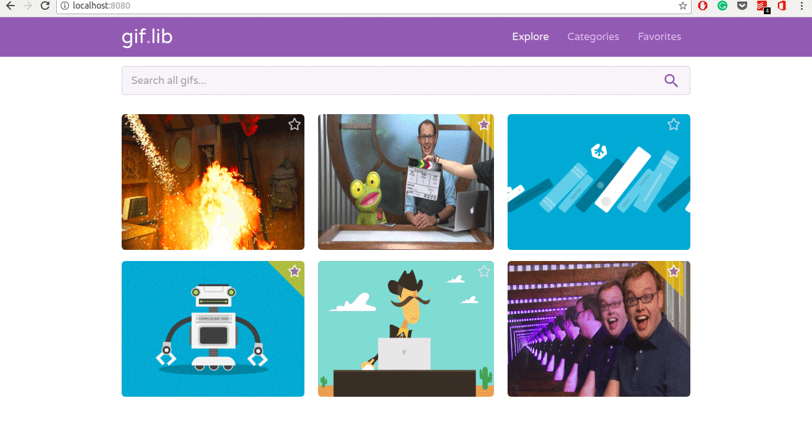

# GIF-Library-SpringBoot-App
A GIF library webapp done using Spring Boot and Thymeleaf

## This is how it looks right now?

## To-Do

 - #### Design

    - [X] Creating a home page
    - [X] Adding categories  
    - [X] Implementing the Favorites Page (/favorites uri)
    - [X] Implementing the Search Page (Through Search Bar)
    - [ ] Creating a login page
    - [ ] Adding user authentication
    - [ ] Adding functionality for adding GIF
    - [ ] Adding functionality for deleting GIF

 - #### Database
 
     - [ ] Creating database for Gifs
     - [ ] Creating database for login credentials
     - [ ] creating database for user data
     
 - #### Testing
 
    - [ ] Adding unit tests for login
    - [ ] Adding unit tests for user data in logout mode
  
 - #### CI/CD
 
    - [ ] Jenkins Integration
 
 - #### Containerize the App
    
    - [ ] Using Docker to containerize the App
